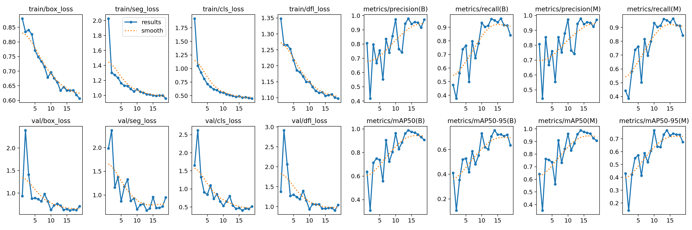

# 🤖 Segmentation Robot Navigation 🚗📡

This project integrates **robot navigation**, **real-time image segmentation**, and **remote control** using **YOLOv5 segmentation**, **ESP32**, **MQTT**, and **Python-based visual intelligence**. The system allows a robot to follow paths or objects identified in a video feed, and can be operated via **teleoperation**, **web API**, or **automated AI control**.

---

## 📁 Project Structure

```

.
├── arduino-code/              # ESP32 firmware: MQTT, ELRS receiver, web API
├── hardware/                  # Wiring and schematics
├── python-code/               # AI segmentation, motor logic, MQTT client
│   ├── \*.py / \*.ipynb         # Scripts for camera, MQTT, real-time inference
│   ├── model.pt               # Trained YOLOv5 segmentation models
│   └── runs/segment           # Training logs, results, and model weights
├── LICENSE
├── README.md
└── requirement.txt            # Python dependencies

```

---

## 🧠 Key Features

### ✅ Robot Side (ESP32)
- **MQTT Subscriber**: Receives commands from segmentation AI.
- **Web API Mode**: Accepts movement commands via HTTP requests.
- **Manual Teleoperation**: Supports control via ELRS radio transmitter.
- **Sensor Feedback**: Reads data from encoder or telemetry for feedback.

### ✅ AI Side (Python)
- **YOLOv5 Segmentation** (custom-trained) for:
  - Line/path detection
  - Lane following
  - Object avoidance
- **Real-Time MQTT Publisher**:
  - Sends throttle and steering commands to robot
- **RTSP Camera Support**:
  - Capture real-time stream from IP/USB cameras

---

## 🚦 Arduino Code Modules

| Folder / File                | Functionality |
|-----------------------------|---------------|
| `mqtt-full-read.ino`        | MQTT + full JSON command parsing |
| `teleoperated-elrs.ino`     | Manual control via ExpressLRS |
| `web-api.ino`               | Control robot via REST API |
| `straight-moving.ino`       | Basic motor test - go straight |
| `motor-test-fix.ino`        | PWM motor tuning |
| `read-data-receiver-elrs.ino` | Read data from ELRS serial |
| `mqtt-api.ino`              | API stub over MQTT |

---

## 🧠 Python AI Modules

| File                       | Function |
|----------------------------|----------|
| `realtime-segmentation.py` | Real-time segmentation and MQTT control |
| `line-following.py`        | Lightweight color-based line following |
| `program-v1.py`            | Integrated control + camera + logic |
| `mqtt-read-data.py`        | MQTT subscriber + robot feedback logging |
| `segmentation-yolov11.ipynb` | Training notebook using YOLOv5 segmentation |
| `read-motor-csv.py/ipynb`  | Data logging and analysis |

---

## 📦 Pretrained Models

Trained using YOLOv5-segmentation and exported in PyTorch `.pt` format:

| Model Filename              | Description |
|-----------------------------|-------------|
| `best.pt`                   | Final selected segmentation model |
| `yolo11s-seg.pt`            | Small YOLO variant with segmentation |
| `yolo11n-seg.pt`            | Nano version for fast inference |
| `train*/weights/best.pt`    | Best weights per training session |

---

## 📊 Training Results

Check under `python-code/runs/segment/train*/`:
- Precision/Recall/F1 Curve (Box and Mask)
- Confusion Matrix
- Labeled Image Outputs
- Model Weights: `best.pt`, `last.pt`

Example visualization:


---

## 🔧 Hardware Requirements

- **ESP32 Devkit**
- **Dual DC Motor Driver (L298N / BTS7960)**
- **12V Gear Motors**
- **Camera** (RTSP/IP or USB)
- **ELRS or Serial receiver (optional)**
- **Battery Pack / BEC Regulator**

Wiring diagram available in:  
`hardware/wiring-esp32.txt`

---

## 💡 How It Works

1. **Camera captures scene**
2. **Python AI** performs segmentation (`YOLOv5-seg`)
3. AI computes steering/throttle → sent via **MQTT**
4. **ESP32** receives and drives motors
5. Optional manual override via **ELRS controller**

---

## ▶️ Quick Start

### 1. ESP32 Firmware
- Flash `arduino-code/mqtt-full-read.ino` to your ESP32
- Configure WiFi and MQTT broker credentials

### 2. Python AI Setup
```bash
# Install dependencies
pip install -r requirement.txt

# Run segmentation and control loop
python python-code/realtime-segmentation.py
```

### 3. Optional Telemetry Dashboard

* View `filtered_turn_throttle_data.csv`
* Analyze motor data with `read-motor-csv.ipynb`

---

## 📦 Python Dependencies

See `requirement.txt`. Key packages include:

* `paho-mqtt`
* `torch`, `opencv-python`
* `ultralytics` or custom YOLOv5 fork

---

## 📜 License

Distributed under the MIT License. See `LICENSE` for more info.

---

## 👤 Author

Developed by **Ardy Seto Priambodo**
Email: [2black0@gmail.com](mailto:2black0@gmail.com)

---

> 🚀 *"From pixels to motion – AI-driven navigation redefined."*